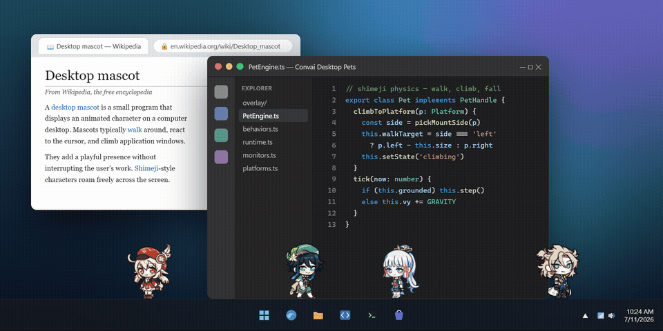
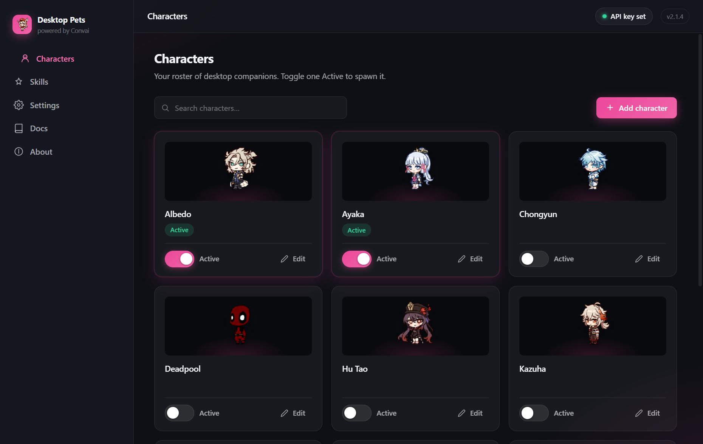

# 🎮 Convai Desktop Pets

> **Trae a tu escritorio compañeros adorables impulsados por IA — ahora más vivos que nunca.**

Pequeños personajes animados que caminan por tu barra de tareas, trepan por tus ventanas, persiguen tu cursor, se hacen amigos entre sí, te recuerdan y mantienen conversaciones habladas reales — impulsados por [Convai](https://convai.com).

[](https://github.com/AkshitIreddy/convai-desktop-pet/releases/latest)
[](./licenses)
[](https://tauri.app)

<p align="center">
  
</p>

---

## ✨ Novedades en la versión 2.0

La versión 2.0 es una **reescritura completa**: mismo alma, cuerpo totalmente nuevo.

- ⚡ **Tauri en lugar de Electron** — aproximadamente **10× más ligero**. Una única ventana de superposición transparente aloja *todos* los pets (la v1 generaba una ventana completa de Chromium por pet), con manejo nativo en Rust para captura de pantalla, seguimiento de ventanas y sondeo del cursor.
- 🗣️ **Convai Web SDK 1.6 (beta)** — conversaciones de voz en tiempo real vía WebRTC, chat de texto con streaming y contexto dinámico para que los personajes sepan lo que sucede en tu escritorio.
- 👀 **Visión de pantalla con permisos temporales** — permite que un personaje vea tu pantalla durante unos minutos (indicador de cuenta regresiva, revocación automática, un solo uso "echa un vistazo"), luego queda ciego de nuevo. Los fotogramas nunca se almacenan.
- 🧠 **Memoria a largo plazo (opcional)** — los personajes pueden recordarte entre sesiones, con un diario de memoria en la aplicación para explorar y eliminar lo que saben.
- 🎡 **Rueda radial de habilidades** — haz clic en un pet para abrir su rueda de 8 habilidades, elegidas por personaje de un catálogo de **22**: voz, visión, recordatorios, temporizador de enfoque, fiesta de baile, modo susurro y más.
- 🐾 **20 comportamientos ambientales** — incluyen **caminar sobre tus ventanas de aplicaciones**, sentarse en alféizares, espiar desde detrás de ventanas, perseguir/observar el cursor y **amistades multi-pet**: paseos lado a lado, presentaciones, sigue al líder, bailes espejo, desfiles por la barra de tareas.
- ⏰ **Recordatorios y notas adhesivas** — tu personaje confirma un recordatorio cuando lo configuras y lo anuncia (voz + notificación nativa) cuando toca.
- 🎨 **18 opciones de personalización** — temas, colores de acento, tamaño/opacidad del pet, nivel de actividad, estilos de burbujas de diálogo, paquetes de sonidos sintetizados, horas de silencio y más.
- 📖 **Documentación integrada** — una guía ilustrada completa reside directamente dentro del panel de control.

<p align="center">
  
</p>

---

## 📥 Descargar

Descarga el instalador para tu sistema operativo desde la **[última versión](https://github.com/AkshitIreddy/convai-desktop-pet/releases/latest)** — una versión, todas las plataformas:

| Plataforma | Archivo |
|----------|------|
| 🪟 **Windows** | `Convai-Desktop-Pets_x.x.x_x64-setup.exe` (instalador NSIS) |
| 🍎 **macOS** | `Convai-Desktop-Pets_x.x.x.dmg` (versiones para Apple Silicon e Intel) |
| 🐧 **Linux** | Paquete `.deb` o `.AppImage` |

👉 [Ver todas las versiones](https://github.com/AkshitIreddy/convai-desktop-pet/releases)

---

## 🚀 Inicio rápido

1. **Instala y lanza** — se abre el panel de control; la superposición del pet inicia discretamente en tu bandeja del sistema.
2. **Conecta Convai** — inicia sesión en [convai.com](https://convai.com), copia tu clave API desde el panel de control (ícono de escudo, esquina superior derecha) y pégala en **Configuración → Conexión**.
3. **Despliega un personaje** — activa el interruptor **Activo** en la página de Personajes y observa cómo aparecen en tu escritorio.
4. **Saluda** — haz clic en un pet para su rueda de habilidades, o **Alt+clic** para chatear de inmediato.
5. **Hazlo tuyo** — habilidades por personaje, voces, libre albedrío, memoria; configuración global para todo lo demás. La página **Documentación** integrada lo cubre todo.

---

## 🎮 Cómo usar

- **Haz clic en un pet** → se abre su **rueda de habilidades** radial (incluso en medio de una caminata). Elige entre chat, voz, visión de pantalla, recordatorios, trucos y más.
- **Alt+clic en un pet** → entra directamente al **panel de chat** — escribe, o activa el micrófono y simplemente habla.
- **Arrastra y lanza** → agarra un pet, impúlsalo y observa cómo cae con impulso real. Si lo lanzas demasiado fuerte, se mareará.
- En todas partes donde *no* estés tocando un pet, los clics pasan directamente a tus aplicaciones — los pets nunca estorban.

<!-- 📸 TODO(Akshit): screenshot — skill wheel closeup around a pet -->

<!-- 📸 TODO(Akshit): screenshot — chat panel conversation with a pet -->

---

## 🧠 Una nota sobre la memoria a largo plazo

La memoria a largo plazo está **desactivada por defecto** para cada personaje. Activarla requiere dos cosas:

1. **Habilitarla en el panel de control de Convai** para ese personaje (personaje → pestaña Memoria → Configuración de memoria → Habilitar memoria a largo plazo).
2. **Un plan de Convai con cuota de memoria** — los límites de usuarios recordados e interacciones varían según el nivel; consulta [convai.com/pricing](https://convai.com/pricing) para los números actuales.

Los IDs de personajes predeterminados incluidos se envían **sin** LTM habilitado en el lado de Convai, por lo que las funciones de memoria no funcionarán directamente hasta que apuntes un personaje a tu propio personaje de Convai con LTM habilitado.

<!-- TODO(Akshit): once an LTM-enabled public character exists, set DEFAULT_LTM_CHARACTER_ID in src/shared/constants.ts so first-run users can try memory features immediately. -->

Los detalles completos, incluido el ID del usuario final y el diario de memoria, están en la Documentación integrada.

---

## 🎨 Personajes disponibles

| Genshin Impact | Otros |
|----------------|--------|
| Ayaka | Deadpool |
| Albedo | SpongeBob |
| Chongyun | Cartman |
| Kazuha | |
| Hu Tao | |
| Klee | |
| Thoma | |
| Venti | |

Cada personaje puede redirigirse a cualquier personaje de Convai que crees — personalidad, historia y voz personalizadas.

---

## 🛠️ Compilar desde el código fuente

Consulta **[BUILDING.md](./BUILDING.md)** para requisitos, flujo de trabajo de desarrollo y el proceso de lanzamiento. El documento de diseño reside en [docs/ARCHITECTURE.md](./docs/ARCHITECTURE.md).

```bash
git clone https://github.com/AkshitIreddy/convai-desktop-pet.git
cd convai-desktop-pet
npm install
npm run tauri dev
```

---

## 🙏 Agradecimientos y Créditos

Este proyecto no sería posible sin el increíble trabajo de los siguientes creadores:

### Artistas de Personajes 🎨
Un gran agradecimiento a los talentosos artistas que crearon las hermosas sprites de los personajes:

- **[@uuteki](https://linktr.ee/uuteki)** — Creador de los shimejis de personajes de Genshin Impact:
  - Venti, Thoma, Kazuha, Ayaka, Chongyun, Klee, Hu Tao y Albedo
- **[Phinbella-Flynn](https://www.deviantart.com/phinbella-flynn/art/Cartman-Shimeji-747213748)** — Creador del shimeji de Cartman
- **[Sojia](https://sojia.deviantart.com/art/Spongebob-Shimeji-Mascot-317014699)** — Creador del shimeji de Spongebob
- **[Cakedoom](https://cakedoom.deviantart.com/art/Deadpool-shimeji-267525091)** — Creador del shimeji de Deadpool

¿Quieres más shimejis? Consulta el [Directorio de Shimejis](https://shimejis.xyz/directory) para ver cientos de personajes.

### Creador Original de Shimeji
- **Yuki Yamada** — Creador del concepto y software original de Shimeji (2009)

### Desarrollo de Shimeji-ee
- **Grupo Shimeji-ee** — Por el motor de Shimeji mejorado
- **[Kilkakon](https://kilkakon.com)** — Por el desarrollo continuado y las mejoras a Shimeji-ee
- **TigerHix** — Por contribuciones en GitHub que se incorporaron a este proyecto

### Bibliotecas Adicionales
- **John O'Conner** — Clases de internacionalización i18n
- **Nilo J. González** — NimROD Look And Feel (LGPL v3)

### Tecnologías
- [Tauri](https://tauri.app) — Marco de trabajo ligero para escritorio multiplataforma
- [Convai](https://convai.com) — Motor de conversación IA
- [LiveKit](https://livekit.io) — Transporte de voz WebRTC en tiempo real (vía el Convai Web SDK)

---

## 📄 Licencia

Este proyecto incluye componentes bajo diversas licencias. Consulta la carpeta [licenses](./licenses/) para ver los detalles completos.

---

## 💖 ¡Disfruta de tus Compañeros de Escritorio!

Si te gusta este proyecto, considera darle una ⭐ en GitHub.

Hecho con ❤️ por [AkshitIreddy](https://github.com/AkshitIreddy)
